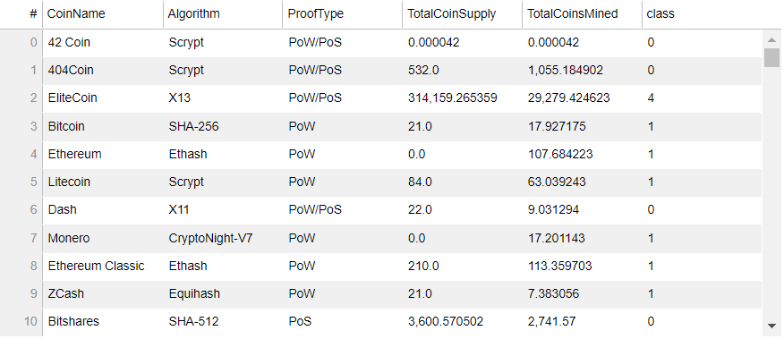

# AWS-Homework

#### Background

This homework assignment put use of unsupervivsed learning and Amazon SageMaker skills into action by clustering cryptocurrencies and creating plots to present the results.
Main tasks:
- Data Preprocessing: Prepare data for dimension reduction with PCA and clustering using K-Means.
- Reducing Data Dimensions Using PCA: Reduce data dimension using the PCA algorithm from sklearn.
- Clustering Cryptocurrencies Using K-Means: Predict clusters using the cryptocurrencies data using the KMeans algorithm from sklearn.
- Visualizing Results: Create some plots and data tables to present your results.
- Optional Challenge: Deploy your notebook to Amazon SageMaker.

#### Data Preprocessing

In this section, loaded the information about cryptocurrencies and performed data preprocessing tasks.
- Used the provided CSV file to create a DataFrame
- Kept only the necessary columns: 'CoinName','Algorithm','IsTrading','ProofType','TotalCoinsMined','TotalCoinSupply'
- Cleaned the data by 
  - Keeping only the cryptocurrencies that are trading.
  - Keeping only the cryptocurrencies with a working algorithm
  - Removing all cryptocurrencies with at least one null value
  - Removing all cryptocurrencies that have no coins mined
  - Dropping all rows where there are 'N/A' text values
- Created dummy variables for all the text features and stored in DataFrame "df_crypto_dummy"
- Used the StandardScaler from sklearn to standardize all the data of the "df_crypto_dummy" DataFrame

#### Reducing Data Dimensions Using PCA

Used the PCA algorithm from sklearn to reduce the dimensions of the df_crypto_dummy DataFrame down to three principal components.

#### Clustering Cryptocurrencies Using K-Means

Used the KMeans algorithm from sklearn to cluster the cryptocurrencies using the df_crypto_pca.

- Used an Elbow Curve and silhouette score to find the best value for k

#### Visualizing Results

Created data visualization to present the final results.
- Created a scatter plot using hvplot, to present the clustered data about cryptocurrencies 

- Used hvplot.table to create a data table with all the current tradable cryptocurrencies

#### Optional Challenge
- Uploaded Jupyter notebook to Amazon SageMaker and renamed (crypto_clustering_sm.ipynb) it
- Used altair library for visualization inplace of hvplot

